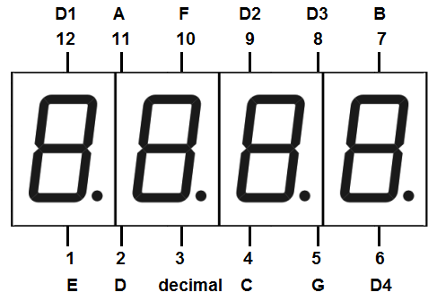
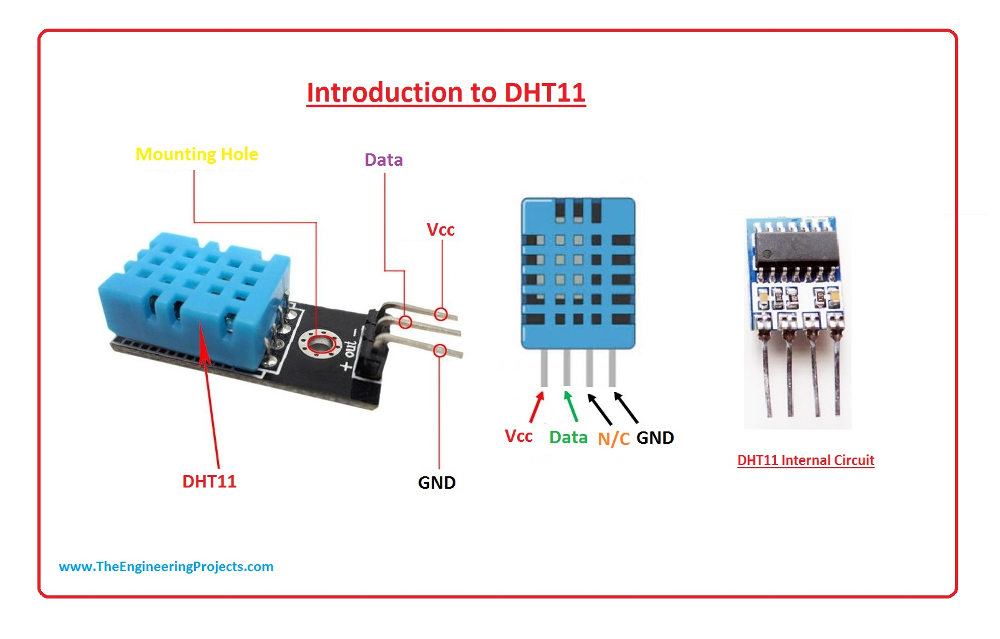
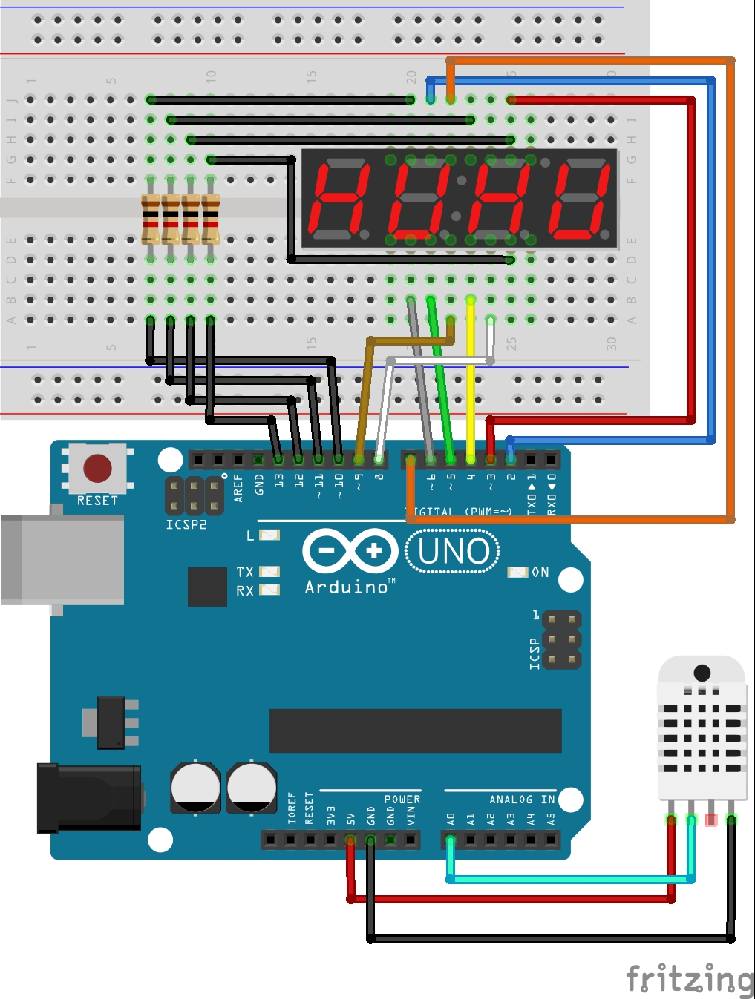

# Medidor de temperatura y humedad

La mayoría de nosotros confiamos en las aplicaciones del tiempo para verificar la temperatura y la humedad. Sin embargo, existe una diferencia entre cómo se siente en interiores y exteriores. Así que quise realizar un mini proyecto con Arduino para medir la temperatura y la humedad dentro de casa.

## Compoenetes utilizados

1. Arduino Uno.
2. Una pantalla LED 4 digit 7 segment.
3. Un sensor de temperatura y humendad DHT11.
4. Cuatro resistencias de 1K ohmio.

## ¿Cómo hacerlo?

Primero tenemos que conectar los componentes, para eso tenemos que entender cómo funcionan.

La pantalla LED 4 digit 7 segment tiene 12 pines. 8 de los pines son para los 8 LED en cada una de las pantallas de 7 segmentos, que van a A a G y DP (punto decimal). Los 4 pines restantes representan cada uno de los 4 dígitos de D1 a D4.

Existen dos presentaciones del sensor de temperatura y humedad DHT11, una forma individual donde solo tenemos el sensor y una donde esta insertado en una PCB. La diferencia de estos dos es que la versión con PCB contiene una resistencia de 5kΩ y un LED. Otra diferencia son los pines.

En la versión sin PCB tiene 4 pines y en la versión con PCB tiene 3 pines. Los pines de la versión sin PCB del DHT11 son:

- VCC: alimentación.
- I/O: transmisión de datos.
- N/C: no conectar, pin al aire.
- GND: tierra.

Los pines de la versión con PCB son:

- GND: tierra.
- DATA: transmisión de datos.
- VCC: alimentación.

Conectamos los 8 pines de los segmentos de la pantalla LED a los pines 2-9 del Arduino, respectivamente. Y los 4 dígitos los conectamos a una resistencia de 1K ohmio y luego a los pines 13-10 del Arduino.

En el caso de sensor conectamos la tierra a el pin GND del Arduino, el pin VCC a 5v y el pin de datos a A0.

